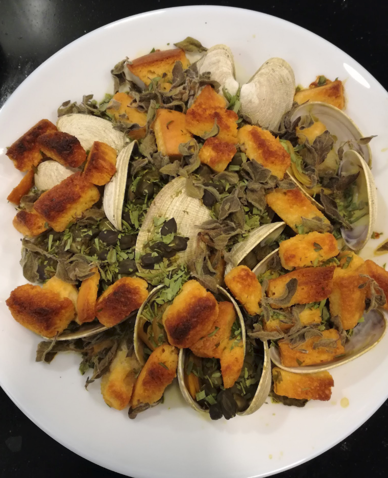

# recipe
This is a recipe generator that uses an evolutionary algorithm to generate recipes. Recipes are modeled as directed acyclic graphs such that source nodes can be ingredients or heat, and the sink node is, essentially, "serve". Evolution is done by simply grafting branches of the parents.

## usage
tbd

## example output

#### This is a generation in graph form without pretty-printing into a normal recipe format.

#### This is the same generation, pretty-printed.
Recipe 38 Gen 200: Baked clams with capers and croutons

*Ingredients*

- Wine - 3.1 tbsp
- Capers - 0.9 cup
- Clams - 1.15 lb
- Croutons - 0.9 cup
- Tarragon - 3.8 tsp
- Marjoram - 1.8 tbsp

*Instructions*

1. Mix wine and capers
2. Add clams and cook on very high heat
3. Turn off heat and hold
4. Add croutons and bake in low heat
5. Add tarragon
6. Add marjoram and bake on high heat
7. Continue baking on high heat
8. Turn down heat and let cool
9. Broil quickly
10. Serve

#### This is the same generation, served.

